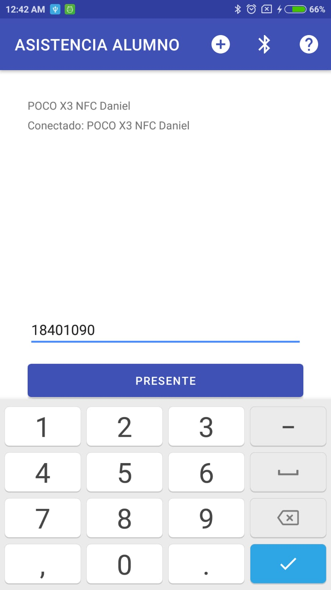

# LADM_U4 ASISTENCIA ALUMNO

Daniel Alejandro Calderón Virgen
No Crtl 18401090
Ing en Sistemas Computacionales
Tecnológico Nacional de México, Campus Tepic

LABORATORIO DE APLICACIONES PARA DISPOSITIVOS MÓVILES
MTI SERGIO BENIGNO CASTILLO VALTIERRA

## Aplicación para pasar lista desde el lado "alumno"

